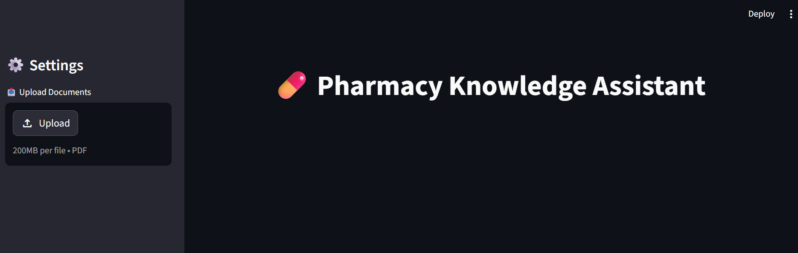
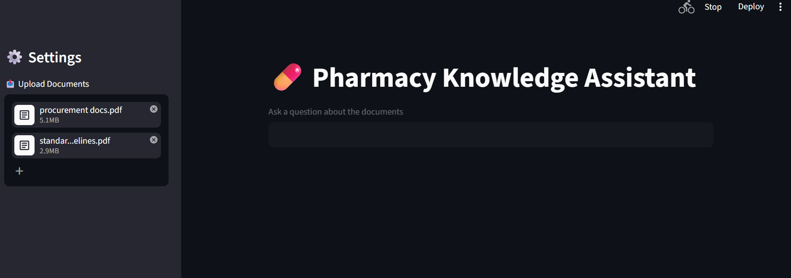
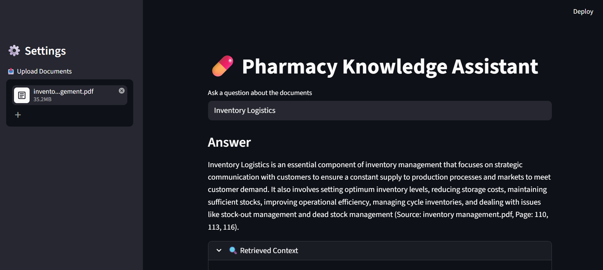
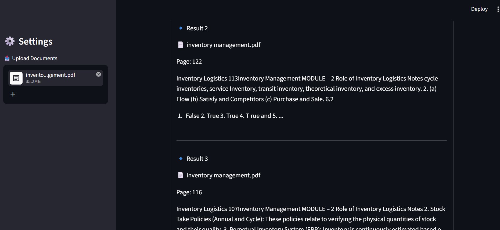

# 💊 Pharmacy Knowledge Assistant

A simple **RAG (Retrieval-Augmented Generation)** application built with **Streamlit + LangChain + OpenAI + FAISS** to answer questions from uploaded PDF documents.

---

## 🚀 Features

* 📤 Upload multiple PDF documents
* 🔍 Extract and split document content
* 🧠 Generate embeddings using OpenAI
* 📚 Store vectors using FAISS
* 🤖 Ask questions and get context-based answers
* 📄 Displays **source references (file name & page number)**
* 🔎 View retrieved chunks for transparency

---

## 🛠️ Tech Stack

* **Frontend:** Streamlit
* **LLM:** OpenAI (ChatOpenAI)
* **Embeddings:** OpenAI Embeddings (`text-embedding-3-small`)
* **Vector DB:** FAISS
* **Framework:** LangChain

---

## 📂 Project Structure

```
.
├── app.py                # Main Streamlit app
├── requirements.txt     # Dependencies
├── .env                 # API keys (not committed)
└── README.md            # Project documentation
```

---
## 📸 Screenshots

### 🏠 Main Interface


### 📤 Upload Documents


### 🤖 Question & Answer


### 🔍 Retrieved Context

---
## ⚙️ Setup Instructions

### 1. Clone the repository

```bash
git clone <your-repo-url>
cd pharmacy-knowledge-assistant
```

---

### 2. Create virtual environment

```bash
python -m venv venv
venv\Scripts\activate   # Windows
```

---

### 3. Install dependencies

```bash
pip install -r requirements.txt
```

---

### 4. Add OpenAI API Key

Create a `.env` file:

```env
OPENAI_API_KEY=your_api_key_here
```

---

### 5. Run the application

```bash
streamlit run app.py
```

---

## 💡 How It Works

1. Upload PDF documents
2. Documents are:

   * Loaded using `PyPDFLoader`
   * Split into chunks
3. Chunks are converted into embeddings
4. Stored in FAISS vector database
5. When a question is asked:

   * Relevant chunks are retrieved
   * Passed as context to LLM
   * Answer generated with sources

---

## 🧪 Example Usage

* Upload pharmacy-related PDFs (drug info, policies, guidelines)
* Ask:

  * "What is the dosage of Paracetamol?"
  * "What are the side effects mentioned?"
* Get answers with:

  ```
  (Source: file_name.pdf, Page: X)
  ```

---

## ⚠️ Notes

* Only answers from uploaded documents
* If answer not found → responds: *"I don't know"*
* Temporary PDF files are created and removed during processing

---

## 🔒 Limitations

* No persistent vector storage (data resets on refresh)
* Depends on OpenAI API usage
* Basic UI (can be enhanced)
* No conversation memory

---

## 🚀 Future Improvements

* Add persistent vector DB (Chroma / Pinecone)
* Support more file types (DOCX, TXT)
* Chat history memory
* Better UI/UX
* Multi-language support

---

## 👩‍💻 Author

**Namitha C Anto**

---

## 📜 License

This project is open-source and free to use.
